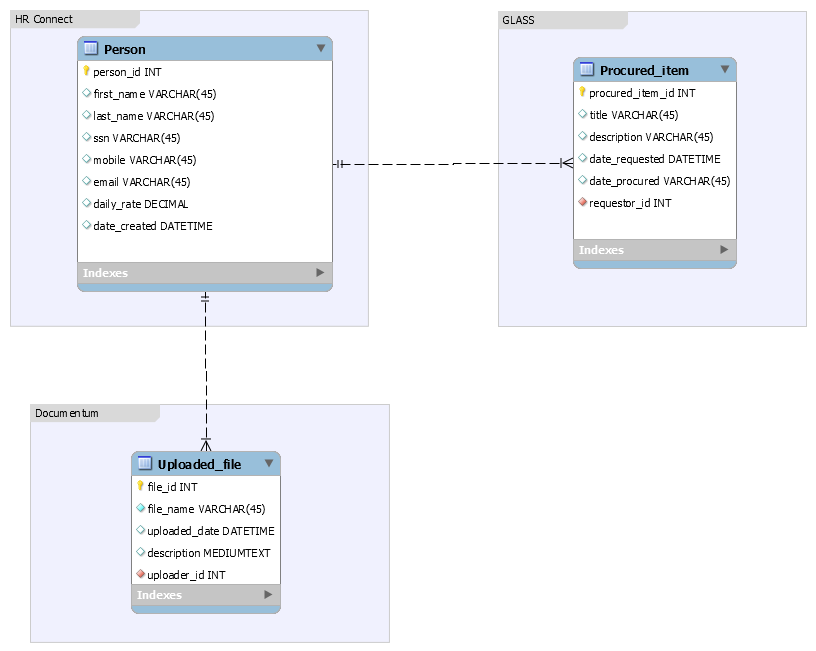

## Aid System Design
This is the repository for system design documents. Code for this project will likely be maintained in a separate repository 

### Models
This is the start of the model description for the light representation of external systems with which the prototype will interact 

[external link to dummy input form](http://aidproto.s3-website-us-east-1.amazonaws.com/)

#### Program
#### Project
#### Activity
#### Development Objective
#### Intermediate Result(IR)

### API
